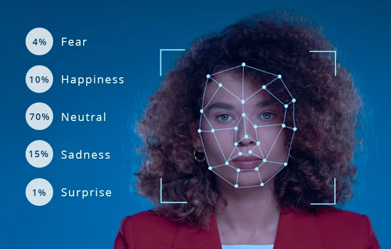

 # Real-Time Emotion Detection with Deep Learning

 

 A real-time emotion detection app using a Convolutional Neural Network (CNN) trained on grayscale facial images, integrated with OpenCV for webcam-based facial recognition.

##  Features
* Real-time emotion recognition via webcam

* Detects emotions: Angry, Disgust, Fear, Happy, Neutral, Sad, Surprise

* Face detection using Haar Cascade Classifier

* CNN-based classification model trained with Keras/TensorFlow

##  Getting Started
1 Clone the repository:

```
https://github.com/Bedantaroy9/Face-Emotion-Recognition.git
```


2 Install the dependencies:

Use pip to install required packages:
```
pip install opencv-python tensorflow numpy
```

3 Run the project:
```
python emotion_detector.py
(Press 'p' to exit the webcam window.)
```


## How It Works
* Captures video using your webcam

* Detects faces using Haar Cascade

* Crops and resizes the face region to 48x48 pixels

* Preprocesses the image and passes it to the CNN

* Predicts the emotion label and displays it in real time


